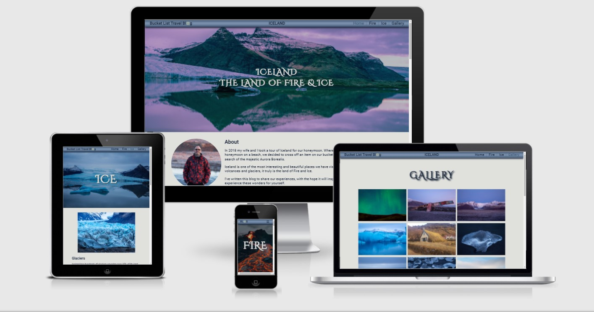
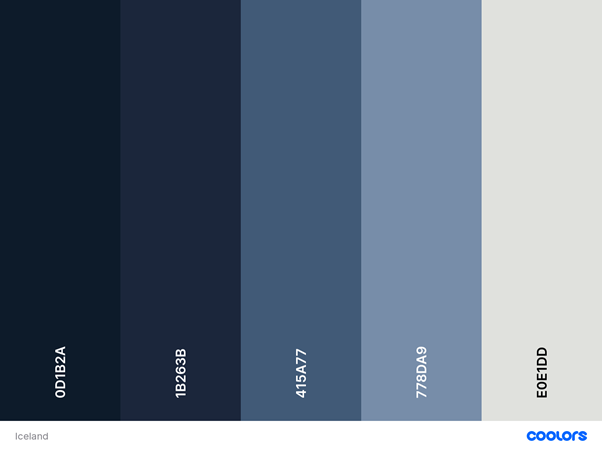
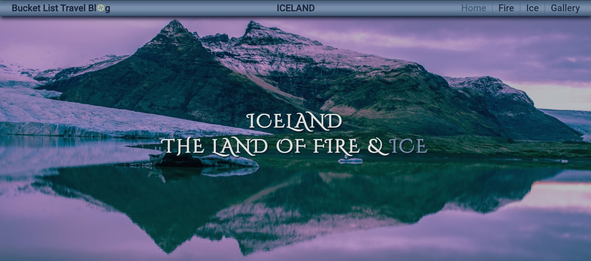
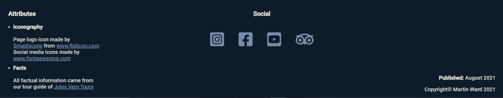
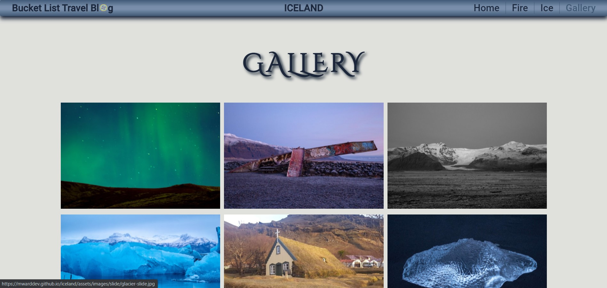
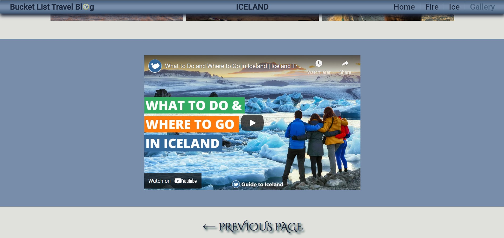

# Iceland 
## The Land of Fire & Ice

This site is a travel blog of my experiences whilst touring the south of Iceland. The purpose of the site is to inspire more people to visit the island or provide information for those already wishing to visit. The site provides information relating to locations I visited and images of the locations and events I witnessed.

[View the live site here.](https://mwarddev.github.io/iceland/index.html)

## Contents

* [Introduction](#iceland)
* [User Experience (UX)](#user-experience-ux)
    * [User Stories](#user-stories)
* [Design (UXD)](#design-uxd)
    * [Strategy](#strategy)
    * [Scope](#scope)
    * [Structure](#structure)
    * [Skeleton](#skeleton)
    * [Surface](#surface)
        * [Colour Palette](#colour-palette)
        * [Typography](#typography)
        * [Imagery](#imagery)
        * [Iconography](#iconography)
* [Features](#features)
    * [Existing Features](#existing-features)
        * [Navigation Bar](#navigation-bar)
        * [Hero Image and Headings](#hero-image-and-headings)
        * [Lower Navigation](#lower-navigation)
        * [Footer](#footer)
        * [Image Gallery](#image-gallery)
        * [Info Video](#info-video)
    * [Future Features](#future-features)
        * [Image Carousel](#image-carousel)
* [Testing](#testing)
    * [Functionality and Usability Testing](#functionality-and-usability-testing)
    * [Focus Group Testing](#focus-group-testing)
    * [Validator Testing](#validator-testing)
    * [Unfixed Bugs](#unfixed-bugs)
* [Deployment](#deployment)
* [Credits](#credits)
    * [Content](#content)
    * [Media](#media)
    * [Code](#code)
    * [Focus Group](#focus-group)
    

## User Experience (UX)

* ### User Stories

    * __As a New Visitor:__

        * I would like to understand the purpose of the site from the start of the landing page.
        * I would like to be able to easily navigate around the site and quickly find the content i'm looking for.
        * I would like to know the author is trusted/recommended by other visitors by way of comments or reviews.
        * I would like to find social media links to other content created by the author. 

    *  __As a Returning Visitor:__

        * I would like to navigate to required information with ease.
        * I would like to navigate to relevant links to external sites with ease.
        * If I have found the information in the site to be useful, i want to be able to leave feedback.

## Design (UXD)

Following the 5 planes of ___User Experience Design___ I whittled 3 ideas down to 1 and used each of the 5 planes to design a site that would answer all of the user stories.

### Strategy

The strategy plane looks at the user's wants and needs, in essence, if a site isn't wanted or needed why build it? The following questions are designed to find this out.

1. Is the content culturally appropriate?
    * Yes. Content is directed at anyone interested in visiting the subject destination.

1. Is the content relevant?
    * Yes. All content contains information about the subject matter.

1. Can we track and catalogue the content in an intuitive way?
    * Yes. We can use paragraphs, captions, images and links.

1. Is the technology appropriate?
    * Yes. Images and text are what people are interested in when looking at similar sites. We could include video also.

1. Why are we so special? What sets us apart?
    * Travel blogs offer a unique opinion from the author and it’s this that gives the product its USP.

1. Tech considerations?
    * Site is being made for the general public so will definitely have to be responsive as most will be viewing on mobile phones.

1. Why would a user want this?
    * Users tend to get opinions from more than one source before committing to a product. Take consumer products for instance, if this wasn’t the case, only one review per product would suffice. However, this isn’t the case and consumers tend to read a few reviews before committing to buy.

Further research into the pros and cons of existing travel blogs helped me to ascertain important and viable elements and features needed to make my site successful.

### Scope

The Scope plane further defines the wants and needs of the user/customer. As such, the following requirements will need to be met:

1. What does the user want to accomplish?
    * Knowledge about a potential destination to visit.

1. What does the user need to do in order to achieve their objective?
    * Navigate through the site, read articles and view images.

1. What constraints does the site or app have to conform within?
    * Limited build time and the use of only HTML & CSS.

1. What dynamic constraints do we have to meet?
    * Make sure information is factually correct.

### Structure

The information gathered in the Strategy and Scope planes is then used to design a site map to allow users to easily navigate the website.

* Landing Page
    * Nav bar (fixed) with links to the Fire page, Ice page and Gallery page.
    * Hero image (Glacier) with title and subtile overlay (links to Fire and Ice in subtile).
    * Introduction, about me, purpose of the site, image.
    * Map of iceland.
    * Brief history of icelandic heritage, image/s.
    * Aurora Borealis section, image.
    * Reykjavik section, images.
    * next page button.
    * Footer with social media links.
* Fire page
    * Nav bar (fixed) with links to the Landing page, Ice page and Gallery page.
    * Hero image (erupting volcano) with title overlay.
    * Lava fields section, image.
    * Geysers section, images.
    * Previous page and next page buttons.
    * Footer with social media links.
* Ice page
    * Nav bar with links to the Landing page, Fire page and Gallery page.
    * Hero image (glacier) with title overlay.
    * Glaciers section, images.
    * Diamond beach section, images.
    * Previous page and next page buttons.
    * Footer with social media links.
* Gallery page
    * Nav bar with links to the Landing page, Fire page and Ice page.
    * Slide show of images (This wasn't implemented in the end product).
    * Static images section.
    * Related video/s
    * Previous page button.
    * Footer with social media links.

### Skeleton

Using the site map developed in the Structure plane the Skeleton plane looks at using that information to develope a blueprint of the website. This gives us some visual representation of the layout of the site. I created wireframes for 3 different platforms (desktop, tablet and mobile) to show responsiveness of the site. The wireframes were created using [Balsamiq](https://balsamiq.com).

View wireframes [here](assets/wireframes/wireframes.pdf).

### Surface

The final layer of design looks at the aesthetic of the site. My goal is to make the site visually appealing to the user while also complementing the imagery and content of the site without compromising accessibility for users with disabilities.

#### Colour Palette

I chose this palette from [coolors](https://coolors.co) to complement the blues of the ice in many of my site's images. 

#### Typography

All fonts have been imported from [Google Fonts](https://fonts.google.com/).

For the headings I went with the cursive font of _*Cinzel Decorative*_. I wanted something quite angular as a nod towards viking runes but also something with a bit of flourish that wouldn't diminish readability.

For paragraph text I went with the recommended pairing of _*Roboto*_ of the _*Sans-Serif*_ font family. Again, this decision was made for improved readability.

#### Imagery

Two images of volcano eruptions were sourced from the royalty free website [Unsplash](https://Unsplash.com). The photos were taken by [Tanya Grypachevskaya](https://unsplash.com/@stilltane4ka?utm_source=unsplash&utm_medium=referral&utm_content=creditCopyText) & [Izabela Kraus](https://unsplash.com/@izabelakraus?utm_source=unsplash&utm_medium=referral&utm_content=creditCopyText) respectively.
One antique map image sourced from the royalty free website [StockSnap](https://stocksnap.io). The photo was taken by [Ylanite Koppens](https://stocksnap.io/author/ylanitekoppens).
All sourced images are cited in captions under the respective images througout the site.

All other images were taken by myself on location.

#### Iconography

The Compass image  used in the website logo and as the tab icon was sourced from the royalty free site [www.flaticon.com](https://www.flaticon.com/) and was made by [Smashicons](https://smashicons.com/) who are cited in the attributes section in th footer of each page.

The social media icons  in the footer section of each page and the hamburger menu icon  for smaller screens were sourced from the royalty free site [fontawesome.com](https://fontawesome.com/).

Navigation arrows are used in the lower page navigation sections and are formed with HTML symbol codes.

## Features

### Existing Features

* #### Navigation Bar
    * The navigation bar is fixed to the top of each page and is only 40 pixels high so doesn't cover much content.
    * As the screen width decreases the destination title is removed, then the navigation menu changes to a hamburger menu and finally the site logo decreases in size.
    * Both the logo and the destination title are links to the landing page. The navigation menu links to all pages and the active page is noted by the page name changing a lighter colour blue. 

    
    
    
    
    * This feature allows the user to easily navigate to any page of the site at any time.

* #### Hero Image and Headings
    * 3 of the 4 pages have a hero image at the top of the page, the landing page, fire page and ice page. Each of the images has a heading overlay.
    * The landing page title Iceland, The Land of Fire And Ice has a link to the fire and ice page respectively if the words fire or ice are clicked.

    
    * This feature draws the user in and makes the page easily identifiable.

* #### Lower Navigation
    * Each page has navigation arrows at the bottom of the page just above the footer. These arrows will take the user to the previous or next page.
    * The text and arrows contain text shadow and when hovered, the shadow is removed to give the illusion of being pressed and the text colour changes.
    * Smaller screen sizes just have arrows.

    
    * This feature allows for natural continuity of the user experience. Once at the bottom of the page a quick click will take them to the next page.  

* #### Footer
    * The footer section of each page contains an attributes section, citing aknowledgement for iconography and information source, a social media section linking to other relevant sites and a copyright section.

    
    * This feature provides information and related content.

* #### Image Gallery
    * The Gallery page contains an image gallery section showcasing other images relevant to the site.
    * On hover the image turns greyscale and clicking an image opens it in a new window.

    
    * This feature showcases the natural wonders of Iceland.

* #### Info Video
    * There is an information youtube video about Iceland embedded in an iframe under the gallery section. The video doesn't auto-play but, being an iframe, it isn't muted.

    
    * This feature makes the site a little more immersive and adds to the interactivity of the site.

### Future Features
* #### Image Carousel
    * A collection of images changeable in a static location on the page. This would go in the Galley page.

## Testing
* ### Functionality and Usability Testing
    * The site has been tested on several platforms and browsers. All outgoing links work and all open in a new window. All internal navigation works.
    * The site has been read with a screen reader and all aria labels and alt text work ok. The screen reader also highlighted a few spelling mistakes which have been corrected.

* ### Focus Group Testing
    * A small group of family and friends tested the live site on a variety of different devices to test for compatability.
    * There was an issue with the drop down menu on Iphones as IOS didn't suport the :focus pseudo class I used. I changed this for the :hover pseudo class to fix the bug.
    * Logo alignment was raised and corrected as was content spacing and text alignment.
    * Suggestions for messages on gallery page to improve UX taken onboard and implemented.

* ### Validator Testing
    * No errors were found when passing through the official 
        

        
W3C Validator

        * [index.html](https://validator.w3.org/nu/?doc=https%3A%2F%2Fmwarddev.github.io%2Ficeland%2Findex.html)
        * [fire.html](https://validator.w3.org/nu/?doc=https%3A%2F%2Fmwarddev.github.io%2Ficeland%2Ffire.html)
        * [ice.html](https://validator.w3.org/nu/?doc=https%3A%2F%2Fmwarddev.github.io%2Ficeland%2Fice.html)
        * [gallery.html](https://validator.w3.org/nu/?doc=https%3A%2F%2Fmwarddev.github.io%2Ficeland%2Fgallery.html)
        

    * No errors were found when passing through the official [(jigsaw) Validator](https://jigsaw.w3.org/css-validator/validator?uri=https%3A%2F%2Fmwarddev.github.io%2Ficeland%2Findex.html&profile=css3svg&usermedium=all&warning=1&vextwarning=&lang=en)
        * All pages passed the Google Chrome Lighthouse reports 
        

        
Reports

        * [index report](assets/readme_images/index_lighthouse_report.jpg)
        * [fire report](assets/readme_images/fire_lighthouse_report.jpg)
        * [ice report](assets/readme_images/ice_lighthouse_report.jpg)
        * [gallery report](assets/readme_images/gallery_lighthouse_report.jpg)
        

## Unfixed Bugs

* CSS Grid isn't suported by Internet Explorer so the gallery page shows as display block. As IE is pretty much obsolete due to the introduction of Microsoft Edge and is still used by very few users, I decided against a workaround.

## Deployment

The site was deployed to Github pages using the following steps:
* In the Github repository, navigate to the settings tab.
* Scroll down and select Pages from the left side navigation menu to open Github pages.
* In the Source section, click on the dropdown menu and select the Master branch.
* Once the Master branch is selected the page will refresh to display a message stating "your site is published at [https://mwarddev.github.io/iceland/](https://mwarddev.github.io/iceland/)"

## Credits

### Content
* Text was written by myself utilising facts passed on from the tour guide of [Jules Vern Travel Agency](https://www.vjv.com). This is cited in the footer of every page in the Attributes section.
* Links to relevant sites are posted throughout the site. These are:
    * [www.earthtrekkers.com](https://www.earthtrekkers.com/10-day-iceland-ring-road-itinerary/)
    * [www.findingtheuniverse.com](https://www.findingtheuniverse.com/iceland-ring-road-itinerary/)
    * [www.tripadvisor.com](https://www.tripadvisor.co.uk/Attractions-g189952-Activities-c49-Iceland.html)
    * [en.vedur.is](https://en.vedur.is/weather/forecasts/aurora/#type=total)
    * [fullsuitcase.com](https://fullsuitcase.com/photograph-northern-lights-beginners/)

### Media
* Almost all images were supplied by myself and taken on location.
* Three images were sourced from royalty free sites [StockSnap.io](https://stocksnap.io) and [Unsplash.com](https://unsplash.com/s/photos/iceland-volcano?utm_source=unsplash&utm_medium=referral&utm_content=creditCopyText). Both the site and photographer are cited in figcapitions under each image.
* The video on the gallery page was sourced from [Youtube.com](https://www.youtube.com) and posted by [Guide to Iceland](https://www.youtube.com/channel/UC-8RFAZFxKGXZlgp9jc2jRw)
* The social media links in the footer link to:
    * [https://www.instagram.com/iceland.explore](https://www.instagram.com/iceland.explore/)
    * [en-gb.facebook.com/guidetoiceland.is/](https://en-gb.facebook.com/guidetoiceland.is/)
    * [Youtube Expedia video](https://www.instagram.com/iceland.explore)
    * [https://www.tripadvisor.co.uk/Tourism-g189952-Iceland-Vacations.html](https://www.tripadvisor.co.uk/Tourism-g189952-Iceland-Vacations.html)

### Code
* All code was written by myself and was learnt from [www.codeinstitute.net](https://www.codeinstitute.net) or [www.sololearn.com](https://www.sololearn.com).
* Inspiration was taken from Dev Ed's drop down menu tutorial on [Youtube](https://www.youtube.com/watch?v=o0YiZF9XZL0) for the mechanics behind my hamburger menu (small section of code) but this didn't work on IOS so I modified it to make it work.
* Inspiration for the hero images was taken from the Love Running Walkthrough project from [www.codeinstitute.net](https://www.codeinstitute.net).
* Icons for the footer were taken from [FontAwesome](https://fontawesome.com/) and is cited in the attributes section of the footer.
* The icon used in the logo and the tab was made by [Smashicons](https://smashicons.com/) and taken from the hoasting site [www.flaticon.com](https://www.flaticon.com/).
* I referenced the site [css-tricks.com](https://css-tricks.com/) to learn how to use Flexbox and CSS Grid.

### Focus Group
* I'd like to thank the following people for the help they gave me with this project:
    * My wife for proof reading content, offering content related suggestions and beta testing the live site.
    * Heather for proof reading content, offering content, UX and grammatical related suggestions, beta testing the live site and spotting bugs.
    * Dalton for beta testing the live site and reporting the IOS menu bug and some alignment issues.
    * Sean for beta testing the live site.
    * John for beta testing the live site.

